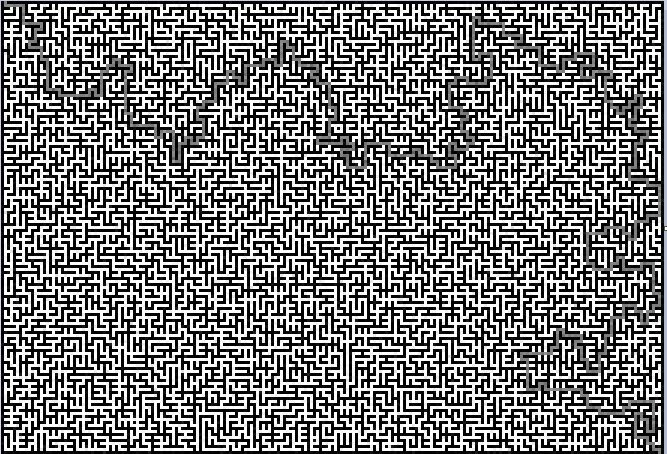
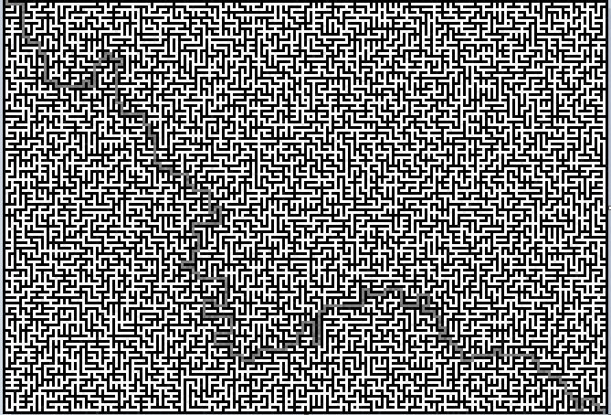

# Mazes
A side project I've created to practice and implement materials learned in the first year of CS studies.

The program contains two main parts:
## Maze Generator
Used to generate random maze images. To create a random perfect maze (A maze with no loops) the generator creates a height x width number of cells, and each cell is inserted to a union-find data structure (implementation is included) as a new group. The generator removes inner walls in random order until all the cells are in the same group.
To generate a multi-path maze, some inner walls are removed at random.

Example of a 151 x 221 pixels multi-path maze:

## Maze Solver
The maze object receives a maze image in its constructor (formatted as produced by the generator) and scans it to create a "graph" representation of it. Solves the maze using an implantation of the "MazeSolver" interface which has a single method "solve". I've created a naive maze solver which solves the maze using left turns only.

Solution of the maze above using the "LeftTurnSolver":

Also, I've created a maze solver which uses an implementation of Dijkstra’s shortest path algorithm to find the shortest solution possible. The algorithm uses a Fibonacci heap implementation which was created as part of a project for a course.

Solution of the maze above using the "DijkstraSolver":

