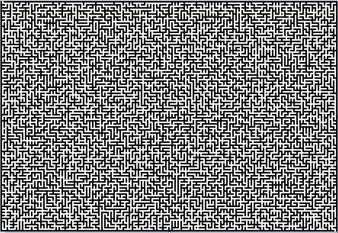

# Mazes
A side project I've created to practice and implement materials learned in the first year of CS studies.

The program contains two main parts:
## Maze Generator
Used to generate random maze images. To create a random perfect maze (A maze with no loops) the generator creates a height x width number of cells, and each cell is inserted to a union-find data structre as a new group. The generator removes inner walls in random order untill all the cells are in the same group.
To generate a multi-path maze, some inner walls are removed at random.

example of a 151 x 221 pixels maze:

